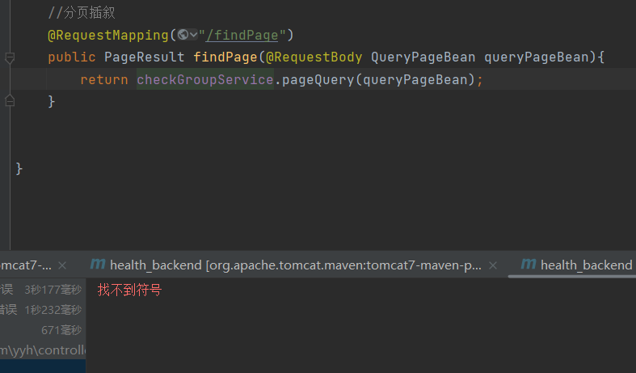
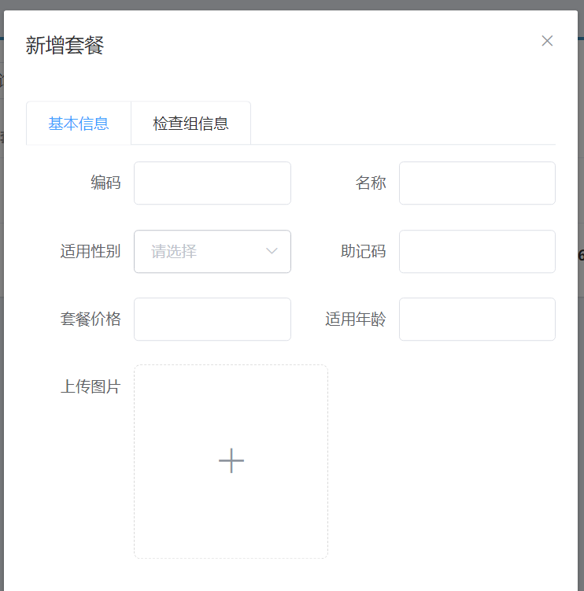
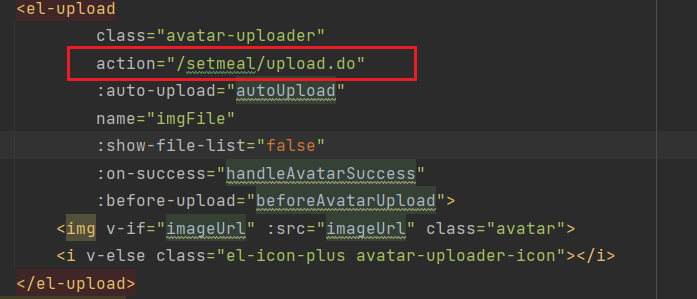

用pageHelper进行分页的业务逻辑：

1. mapper层定义接口，返回值是Page<>, （这个Page继承Arraylist),然后会在自动在sql中插入limit，所以返回的就是一个有限制条数的list,也就是一个Page
2. service层定义接口，返回值是自定义的PageResult 在这里使用PageHelper传入页码和每页显示的条数，然后调用mapper，
3. controller,返回值是PageResult
注意不是直接返回Page, 而是需要我们定义一个序列化好的PageResult，否则无法网络传输。

注意我们这个项目的maven结构，三层都放在了不同的包（模块）里面，所以maven clean 和 maven install的时候，注意要对依赖的包都重新编译。
比如controller层里面 注入了interface模块service，所以必须要吧interface层也编译了，否则controller层无法注入service层。

新增套餐：客户端上传图片-->业务服务端接收图片--->上传到七牛云-->业务服务端返回图片的URL给客户端
--> 点击这个加号，选择完图片就会立即上传到业务服务端，然后返回图片的URL给客户端  
